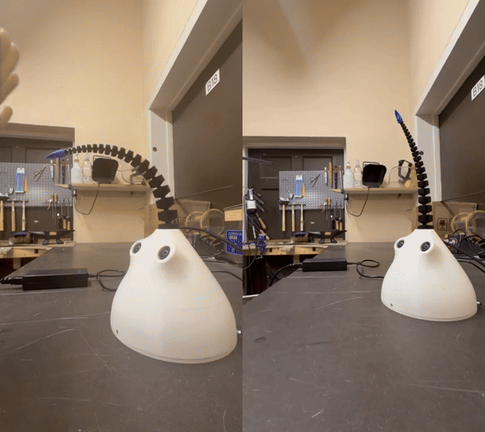
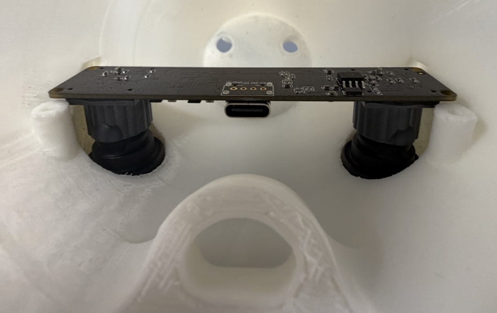
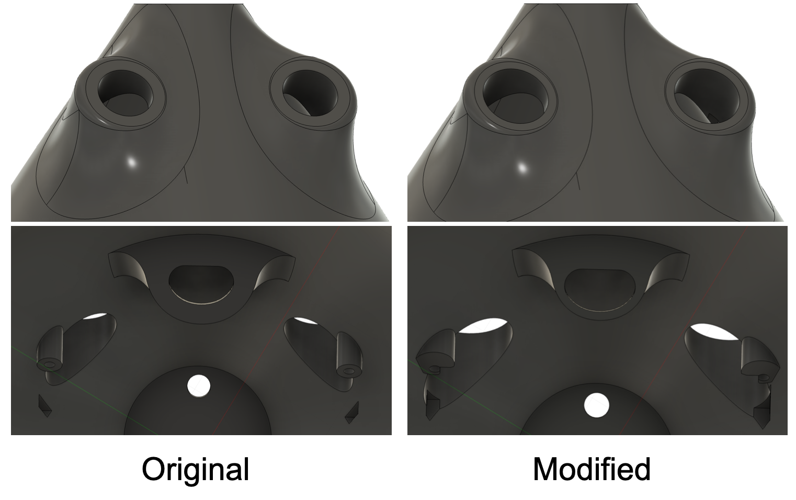
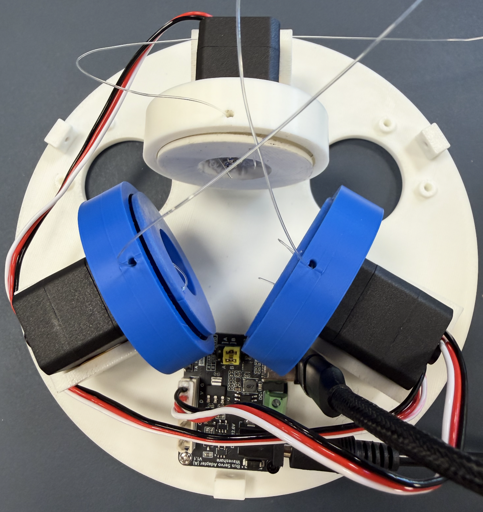
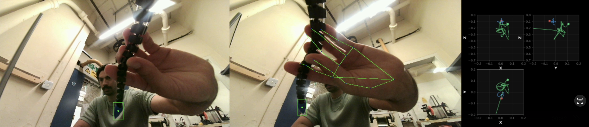
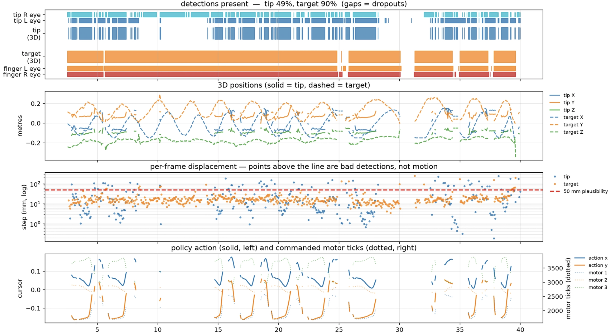
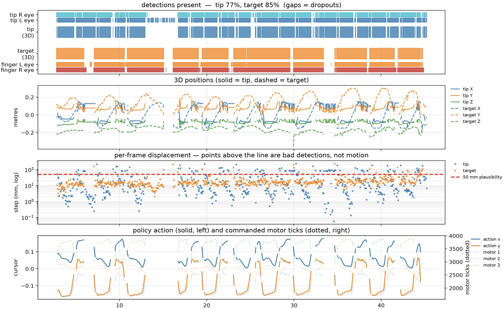

# Building Shoggoth Mini — Part 1: Getting It Working

---

## Introduction

Shoggoth-Mini is a soft-bodied robot using a tentacle as its end effector, based on the SpiRobs design, driven by 3 closed-loop servo motors, controlled via a combination of reinforcement learning and API calls to ChatGPT. The design and setup originates from Matthieu Le Cauchois.

This is my build of this project, in which I’ll outline what’s different, what broke, and what’s next.

Original project: [Shoggoth Mini](https://github.com/mlecauchois/shoggoth-mini/tree/main) by Matthieu Le Cauchois: writeup, repo, STEPs. 

---

## Why

My main interest in building Shoggoth Mini is to use it as a testbed to look into non-anthropomorphic emotional expression (similar to what’s explored in the ELEGNT paper). I find the problem space of robots communicating internal state to human observers an interesting one, especially with the constraints of form-factors that are non-anthropomorphic. Additionally, a lot of the hardware and concepts in the project like motors, cameras, calibration had a natural overlap with my technical background of camera hardware and metrology, so the project seemed like a great jumping off point into the world of modern robotics.

---

#### A Note On AI-assisted development
The core of this project is Matthieu's code. What I added on top was the calibration tooling, the motor characterisation, loop telemetry scripts, and the port to the GA Realtime API. Those I wrote with Claude Code. It was fast at that kind of work, and was not of much help for the more time-costly bugs, which were almost all hardware-facing and as is typical hardware, won't produce a neat error message for you to reason about :)

---

## What's Different Materially

First, there are some minor differences from what’s in Matthieu’s original BOM.

| | Upstream | Mine | Why / consequence |
|---|---|---|---|
| Stereo camera | ELP `USB3D1080P02`, 130° FOV | ELP `USB3D1080P02-H120-DE`, 120° | Original listing dead. Same 80 × 16.5 mm board family → PCB was a drop-in. **The lens barrels were not** and so needed CAD changes to the dome eye holes + one test print. |
| Tentacle material | TPU 95A | TPU 90A | Makerspace stock. No control-policy change. Slightly more recoil/springiness on `shake` and `yes`/`no`; not a dealbreaker. |
| USB connection | — | USB-A hop required | Camera is USB 2.0 in a USB-C shell with no CC pull-down resistors → direct C-to-C never enumerates. Permanent hub in the cable chain. |
| Rollers | — | Printed with supports | Printed unsupported; they rubbed the covers. |
| `lerobot` | latest | pinned older version | Current release broke the motor bus API this project uses. |
| Detection threshold | 0.30 | 0.15 | Per-eye tip rates 60.7/70.6% → 86.9/83.5%; 3-D 48.5% → 77.4%, outlier rate unchanged. |
| Velocity gate | none | `tip/target_max_speed_m_s: 0.75` | Removes 100% of >50 mm jumps at zero cost to acting rate. |

The most consequential difference ended up being the camera I had used. The original appeared to be no longer listed, so I went with a 120˚ FOV camera that had a slightly different MCO, which required me to make some CAD changes to the dome .step file (see next section on details)

---

## The Build - Deviations and What Wasn't Obvious

### Dome Redesign
The first main deviation was the redesign of the dome to accommodate the different stereo camera component. Unfortunately this was learned after going through the first several-hour long dome print. 

As a result, I imported the original dome.step file, got my hands dirty with Fusion360 and  made the following primary changes after measuring the key dimension of the stereo camera:

1) Widening the eye holes to give generous clearance while the camera was aligned with the mount holes + small baseline delta 
2) Moving the recesses on the inside of the dome and deepening them to allow for more play when mounting the camera 
3) Widened the bosses and moved the hole (rather than removing and generating new bosses outright) to accommodate the wider tolerance on this camera's mounting holes
4) Reduced the thickness of the O-loop that tendon 2 passes through to give more clearance to the USB-C cable leaving the camera PCB (thinned the OD by 3 mm)

### Tendon + Wire Threading and Roller Assembly

Matthieu mentions this, but the assembly of the rollers and tendon wire onto the motors is the most finicky part. A few things I found helpful that weren't explicitly called out:
1) Route the wire through the roller and roller cover holes first, that helped remove the seemingly surgical procedure of threading it while the rollers are fixed and mounting was still sound

2) Use the splined aluminum horn and align it on the motor shaft first and then mount the roller with screws (repeat for each motor). This is quite tedious as there are 25 teeth that you need to align carefully with the shaft to have the horn 'slot' in and hook on to the shaft. You will feel it, it should be noticeable, but you might need to play with different horn-motor combos and don't force the horn on there as it can deform the teeth.

3) I'd recommend tension relieving the USB-C and power cables (I used hot glue and stuck them either to the dome or base plate). Especially important for the camera as any strong tugs could pull on it and change its orientation, potentially breaking its calibration

### Motor Calibration
Matthieu provides a calibration script that uses the arrow keys to tighten or loosen each motor, with the goal of leaving the tentacle upright and well-tensioned at the final calibrated position. That's a necessary condition, but I found it isn't a sufficient one. The calibration can look great at neutral position and match the conditions Matthieu outlined but then still fall apart across the tentacle's actual range of motion.

The test that actually catches this is an open-loop sweep: drive from neutral out to a cursor magnitude of 0.18-0.25, at 6-8 equally spaced angular positions. A good calibration gives you distinct movement at every angle, with displacement that's consistent between positions and matches the commanded magnitude. Anything that's short, lopsided, or indistinguishable from its neighbour means the calibrated position needs work.

For the fix I wrote tools/retension.py, which winds or unwinds a specified number of ticks so you can nudge the calibrated position precisely rather than re-running the arrow-key script from scratch. It takes a few rounds of retension-and-retest, but in the end, you get a calibration that holds across the whole intended actuation space rather than just at the pose you tuned it in.

---

## Closed Loop: Perception + Finger Tracking

### Camera Calibration

The first layer of the perception comes from the stereo camera. In order to infer a 3D position of the tentacle tip and hands to the finger tracking primitive, the cameras need to be calibrated in order to convert locations in pixel space to world coordinates. For the calibration, I used a custo-generated 9x6 checkerboard pattern that I then displayed on an iPad (I had some concerns about glare from the screen but that didn't cause any issues for the corner detection). I ran Matthieu's script for the image collection and then (with Claude Code's help) ran a modified version of his python notebook as a script to execute the calibration on the 20 captured stereo images. See the results below:

| Measurement | Result |
|---|---|
| Intrinsic RMS | L = 0.250 px, R = 0.248 px |
| Stereo RMS | 0.399 px |
| Recovered Baseline | 58.5 mm (actual measured ~= 59.5 mm) |

Looks healthy! However, when validating the cal using the same set of images and comparing to the ground truth square size of the pattern (16 mm), I got the following:

| Measurement | Result |
|---|---|
| Input Square | 16 mm |
| Reconstructed square | 14.22 mm |
| Metric scale error | -11.1 % |
| Planarity RMS | mean 0.73 mm |

The scale from the reconstruction is quite off! After some debugging the issue turned out to be a frame convention mismatch, one that the calibration metrics would not have caught.

The script's own advice was to re-measure the board. This sent me down the wrong path though: scaling --square-mm by any factor s scales the object points by s, hence the reconstructed square. The reported error is a ratio of two quantities that both scale by s, so it is invariant to the square size. The other tell was that the error was round and stable (−11.1%, std 0.86) rather than noisy, implying a systematic effect rather than a bad measurement.

The real cause was that cv2.stereoRectify returns R1, R2, P1, P2 as a matched set. R1/R2 rotate each camera into the rectified frame; P1/P2 are only meaningful in that frame. My calibration script computed R1/R2 and then discarded them, saving only P1/P2 — while upstream's perception/stereo.py calls cv2.undistortPoints(pts, K, D, P=P) with no R. So points were undistorted into the original camera frame and then triangulated against rectified projection matrices. The two sensors are physically tilted a few degrees relative to each other, and that unapplied rotation showed up as a consistent depth bias.

Neither half was wrong on its own. Upstream undistorts without R because it was written against a DeepLabCut pickle, which stores the unrectified convention. I'd replaced DeepLabCut with my own OpenCV script as DLC was painful to install on arm64 and emitted rectified matrices into the same dictionary keys.

The fix was to carry R1/R2 through the pipeline and pass them to undistortPoints. Re-running on the same images, with no re-shooting, corrected all three metrics at once:

|                    | Before  | After   |
|--------------------|---------|---------|
| Metric scale error | −11.1%  | +0.1%   |
| Spacing std        | 0.86    | 0.34    |
| Planarity RMS      | 0.73 mm | 0.53 mm |

### Camera-Robot Transformation

Now that the camera calibration was working and verified, it was time to compute the camera-robot transform, which would put all our camera world measurements of the tip and hands into the useful tentacle coordinate frame to speak the same language as our motors. This is a 6 degree-of-freedom matrix (3 for rotation, 3 for translation), but based on the mechanical layout, we can assume 4 of them to be roughly zero based on the camera placement relative to the tentacle: yaw, roll (rotation about Y and Z: constrained by the board mount) & lateral, depth (X and Z: camera centered on the dome, camera OC roughly below tentacle base). This leaves pitch (rotation about X) and Y offset. Matthieu used predetermined values for both. Given my dome redesign and larger tolerances, I couldn't make the same assumption and so measured the camera X-tilt directly using the checkerboard (propped at 90˚ to the floor, measured the vector of the average column direction) and for the Y-offset, I used a tape measure from base to the camera OC.

(image showing the coordinate frames)

| | Result |
|---|---|
| Stereo RMS | 0.399 px |
| Reconstruction accuracy | 16.02 mm measured vs 16.00 mm input (+0.1%) |
| Camera→robot tilt | 39.52°, 0.21° residual, 0.04° frame-to-frame spread |

### Finger Tracking Debug

After the camera cal and transform was done, I ran the perception debug script that Matthieu provided to live plot the tip and hand tracking. After some initial debug, it turned out pretty solid! It's important to note that I did not end up fine-tuning the YOLO vision model for the tip detection with images of my own printed tentacle and that Matthieu's own tuned weights provided in the repo were sufficient.

Satisfied with the detection performance, I moved on to testing the full closed loop tracking. Of course running it right out the gate, the performance wasn't great. The tentacle would be quite jerky and often re-homing, suggesting the tip wasn't being detected properly.

To better diagnose this, I went ahead with some debug plotting to outline exactly what the key inputs and outputs in the control policy were doing.

Off the bat, one obvious issue was that the tip in the left stereo image was only being detected maybe about 60% of the time. Before trying to retune the model, I first reduced the confidence threshold to .15, given that detection is needed for both eyes in order to infer a 3D position and the false detection rate (at least visually checking with the debug-perception script) was quite low, though I've only tested in one environment so far, so no guarantee this will hold up in different background scenes. With that, the detection rate improved dramatically.

With that reduction, the stereo (L & R) detection rate increased to about 80%. I repeated this a few times, though I wouldn't say the behavior is wholesale repeatable and there definitely is some trade-off in the noisiness of the 3D inferred position. The hand detection rate was quite stable and any dropouts were vastly due to part of my hand leaving the stereo camera FOV (I was able to figure this out by enabling a live version of the above debugging plots).

An additional protection added against a bad detection was a velocity gate that would reject any detection that'd imply >750 mm/s from the last point. It would return a None value, which the loop already handles as a missing detection; it deliberately does not substitute the last good position, since nothing downstream could tell a stale point from a fresh one. However, this failed to reduce overall 'perceived' jerkiness of the policy.

## Orchestrate
The 'orchestrate' mode brings everything together under one umbrella as the top layer. It connects the robot to OpenAI's Realtime API over a websocket, streaming microphone audio up and speech back down. Shoggoth-Mini's motions are exposed to the model as callable tools, so the LLM decides both what to say and what to do: you speak, it hears you, and it can answer with words, with movement, or both.

One change needed to be made was migrating the OpenAI Realtime beta API to GA.

Besides the finger tracking, all the other motion primitives used in orchestrate are open loop, so detection and issues discussed in the previous section are not applicable. 

While I was able to get orchestrate to run, I found it to be a bit unstable in terms of handling voice commands and different states, which did break the illusion of shoggoth-mini feeling alive. Something I'd like to iterate on with the next version while addressing some of the big issues I found in my bring up.

## Open Issues

### Motor Calibration Sensitivity
By far the biggest issue is how sensitive the robot's dynamics and actuation are to your initial calibration and where that calibration lives relative to the overall position encoder range. As stated by Matthieu, you ideally want to have the calibration live at the center (~2050), which gives you the maximum range to actuate the tendons to and from your neutral position. Of course, I would often find my ideal calibrated tentacle position being far from this after going through a few rounds of retensioning, which would then  limit the actuation space and if it was biased enough, wholly rule out certain types of motions like grab.

### FW Position Handling and Guardrails
I attempted to fix the calibration sensitivity by making changes to the FW position guard rails to accomodate values beyond 4095 (which the FW is capable of doing, but at the moment, I don't have a solid characterization of handling multi-turns/positions beyond 4095). Something I will be addressing in the next update. (add some more details)

### Finger Tracking Jerkiness
I wouldn't call the tracking a home run yet. This is one area I might forego as my interest in the platform is more as a vehicle for animated expressions (which is more open-loop behavior) and interaction with the user, but something to keep track of.

---

## Lessons

1. **USB-C Camera won't enumerate over USB-C:** a bit of a silly one, but the camera board is really USB 2.0 in a USB-C shell with the CC pull-down resistors omitted, so using a USB-C to USB-C connection is electrically mute. I ended up using the USB-C to A cable that was shipped with it (should've been my hint) with a USB-A to C adapter to connect to the host (my computer) USB-C port.

2. **Writing `Mode` clears `Torque_Enable`:** on these servos, writing the Mode register clears Torque_Enable. And nothing in the codebase ever writes Torque_Enable at all, it had always just inherited whatever state the motor happened to power up in. On the author's units that default was evidently fine. On mine, the mode write silently switched the torque off, and from then on the servo would acknowledge every position command it was given and never move a millimetre. The fix is one line. 

3. **3D Printing Familiarization:** it was my first time 3D printing so familiarizing myself with the small world of slicing and supports. Biggest issue I had was with the rollers themselves. I opted not to go with supports when printing them but that created some downstream issues. They're the simplest geometry in the build and they're the only part that has to rotate inside another printed part, so I printed them without supports, because they looked trivial. The issue was that flange overhangs the waist, so it drooped, and droop on a rotating part eats the running clearance directly. All three caught and dragged inside their covers and needed filing down by hand before they'd spin free.

---

## What's next

In addition to addressing some of the highlighted issues and getting a more stable behavior out of shoggoth-mini, I would like to use it next as platform to explore expressive motions (likely going beyond the 2D projection), add non-human sound, and potentially additional layers of perception to create a more emotive and interactive experience.

Watch the repo and subscribe for the next update!

---

## Credits & links

- Original project, hardware design and writeup: **Matthieu Le Cauchois** —
  [mlecauchois/shoggoth-mini](https://github.com/mlecauchois/shoggoth-mini).
  This repository is a derivative of that work, used under the MIT licence.
- My build and code: [stosifian/shoggoth-mini-bringup](https://github.com/stosifian/shoggoth-mini-bringup) (tag `v1.0`)
- The characterisation tools behind the motor findings in this writeup are in
  [`tools/`](tools/) — `char_a2_wheelmode.py`, `char_b_speed.py`,
  `char_c_step.py`, `char_de_boundary.py`, `char_bus_writes.py` and
  `char_primitive_sweep.py`. Each carries its rationale, method and safety
  argument in its module docstring, and each writes a CSV plus a plot.
