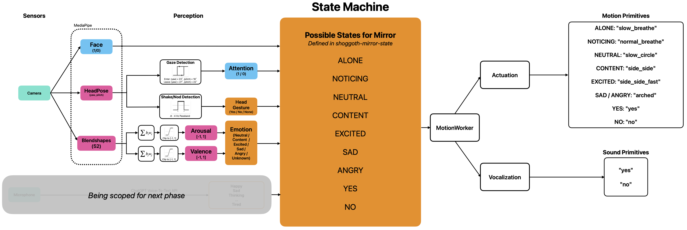
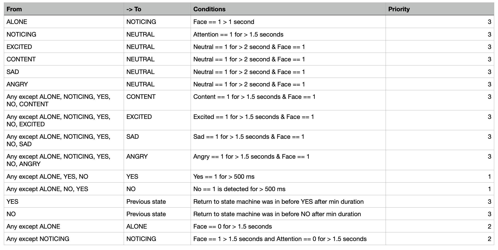
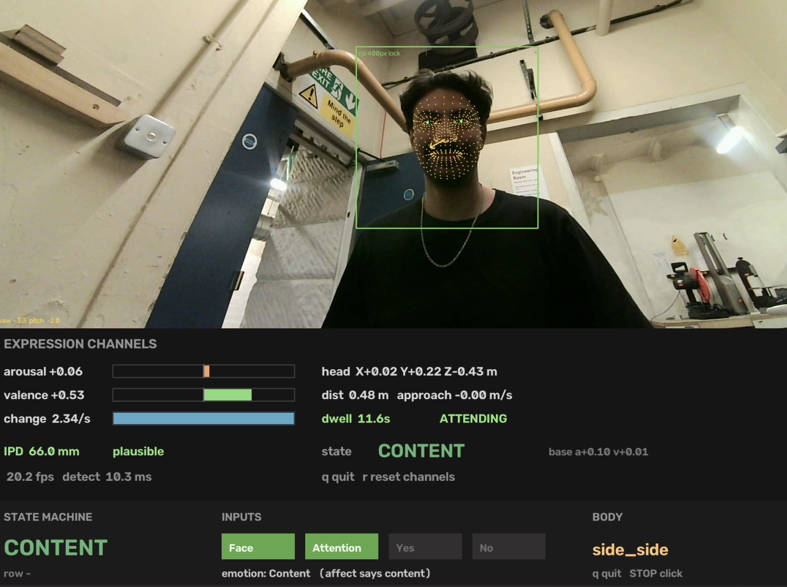
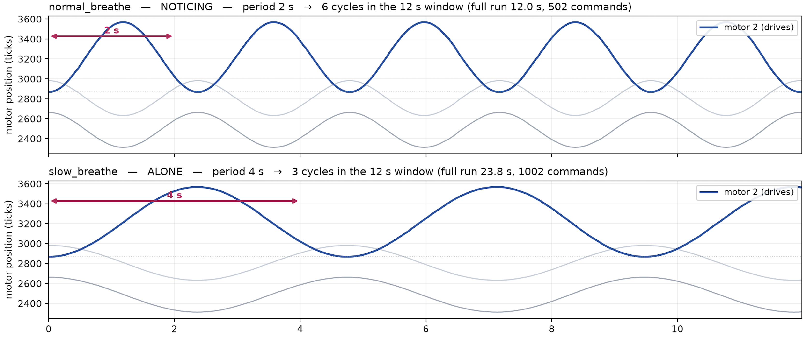
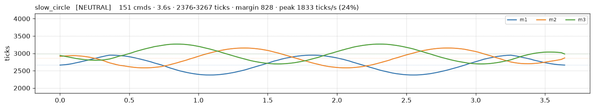
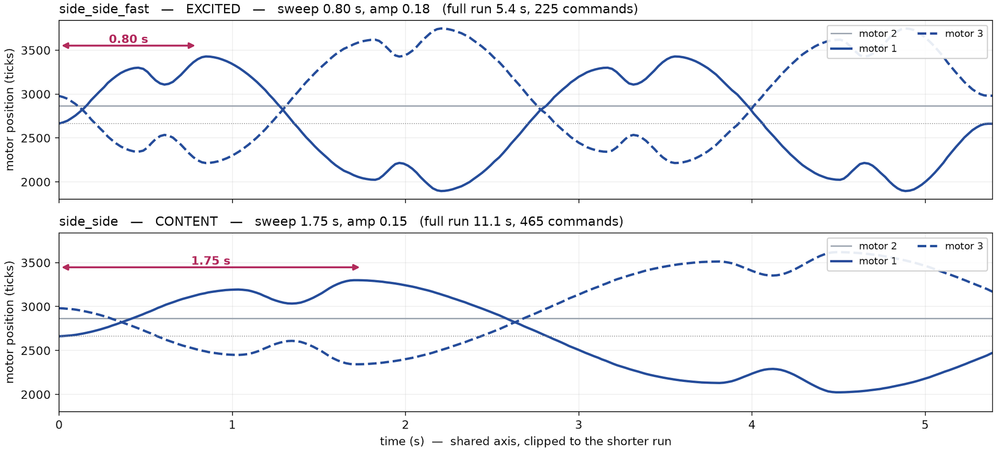
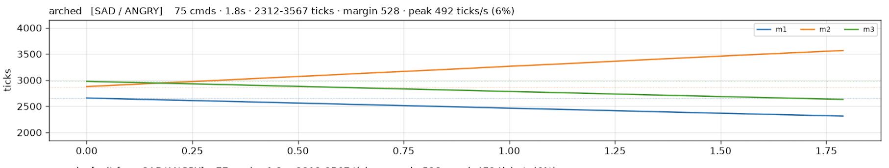
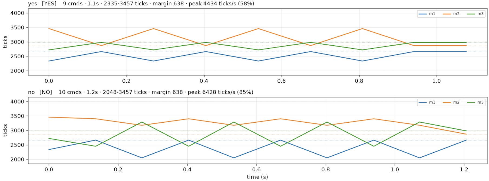
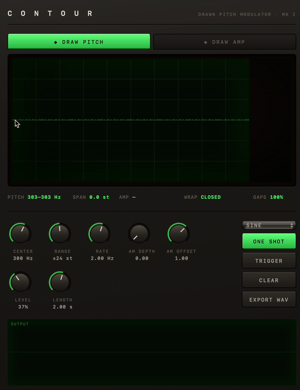

# Building Shoggoth Mini — Part 2: Shoggoth Mirror

<!-- SKELETON. Section headers and notes to write into; prose is yours.
     Notes in HTML comments are prompts and figures to hand, not copy.
     Numbers quoted below are measured and traceable to a commit or a tool run;
     re-check any of them before publishing, since the tuning is still moving. -->

---

## Introduction

<!-- Two sentences on what the mirror IS, before any implementation detail:
     it watches a face and mirrors the state back through movement.
     Part 1 opened with a GIF and that worked; lead with one here too.
     Link back to Part 1, which ended promising exactly this:
     "explore expressive motions (likely going beyond the 2D projection), add
     non-human sound, and potentially additional layers of perception." -->

Shoggoth-Mirror is a second-iteration on the original Shoggoth project, where now via the camera it perceives the user's face and mirrors the perceived state of the user back through movement of its tentacle.

---

## Why a mirror

<!-- Picks up Part 1's "Why". The ELEGNT paper (arXiv 2501.12493) splits
     expressive movement into four: intention, attention, attitude, emotion.
     Worth saying which two you went after and why.

     The honest framing of ELEGNT: it is research-through-design. They hand-
     authored trajectories per scenario and ran a user study; nobody solves the
     max F + gamma*E optimisation online. So what carries over is the LENS, not
     an algorithm.

     The tentacle-with-no-face angle is the interesting constraint, not a
     limitation: if affect reads at all here it reads through movement alone. -->

Given that I'm working toward making Shoggoth a fully-interactive multi-modal 'device', my goal was to first have Shoggoth act as 'mirror' to the user. Perceiving the user's state of course is a fundamental part to human-robot interaction, so I figured having this first step would be 1) useful to debug how perception translates into conception of a user's 'state' and 2) a good springboard to explore a larger space of motions as well as including sound to develop better intuition how to make Shoggoth appear "lifelike", even as a mirror.

I looked to the ELEGNT paper as some inspiration for this phase. The authors split expressive momvement into four categories: intention, attention, attitude, and emotion. With this mirror phase, the emphasis is on attention and emotion. Attention of course in perceiving the user and deducing a state and emotion in trying to play back that that perceived state in an expressive enough motion that the user can intuit an 'emotional' state from Shoggoth. Given that Shoggoth's only form of expression is tentacle movement and sound, it's an interesting constraint. 


---

## System Design

<!-- The most distinctive decision in the project and worth its own section.

     States, transitions and timings are CSV tables the robot reads at runtime.
     tools/fsm_check.py reads the same tables and checks them. So does the
     diagram: --diagram emits mermaid from the parsed table, which cannot
     describe a machine other than the one that runs. A hand-drawn diagram is a
     second reading of the tables and can be wrong in ways nobody notices.

     Figure: verify/mirror_fsm.mmd (renders on GitHub in a ```mermaid fence)

     What the checker does, and why each pass exists:
       static        every symbol resolves
       determinism   for every (state, input), how many transitions fire?
       reachability  dead states, and states you can never leave
       replay        drive it from a real recording

     The clash map is the figure that earns its place: 62 clashing cells of 310
     collapsed to 0, and the picture showed they were nearly all ONE over-broad
     row rather than twenty separate problems. -->


<p align="center">
  
  <br>
  <em>System Diagram for Shoggoth-Mirror</em>
</p>

The overall system flow for Shoggoth-Mirror can be best encapsulated at a high-level in the diagram above. Overall, the camera feed drives the perception. A variety of machine learning models under the MediaPipe framework from Google extract features like facial presence, pose, and blendshape (facial and eye movements). Those artifacts are fed into a variety of detection schema for inferring input states that go into the state machine. At the moment broken down into, the following inputs are: attention (is user facing Shoggoth), head gesture (did user nod 'yes' or shake 'no'), and Emotion (inferred from arousal and valence values).

These states are then fed into the state machine, which determines the overall state of the user that Shoggoth will mirror and then plays that state back via MotionWorker (which essentially carries the motion primitive and vocalization to be played based on the state). The state machine architecture is defined by state tables that I defined (4 tables overall, in shoggoth-mirror-state folder) which are parsed and then implemented in `affect/fsm.py`. See the transition definitions table below:

<p align="center">
  
  <br>
  <em>State Transition Table for Shoggoth Mirror</em>
</p>


The parser converts the definitions laid out in the tables into executable transitions: each row's condition becomes a list of Terms, its hold time a float, and "Any except ALONE" an explicit list of source states. Nothing restates the table in code, so the checker, the generated diagram and Shoggoth are all reading the same 9 states and 16 rows.

Some insight behind some of the transition choices:

1) For "Yes" and "No" detection, I set that as priority 1 as it should override any current state to communicate the fact that it acknowledges/mirrors the user's shaking/nodding.

2) Transitioning to ALONE when face is not present: this should override any previously registered emotion state, hence priority 2

3) Transition to NOTICING: similar with 2, this should override any previously registered emotion state once attention is lost


---

## Perception: from a face to a number

<!-- MediaPipe FaceLandmarker (a bundle: BlazeFace + FaceMesh + a blendshape
     head), then the part that is actually yours: running two views through the
     project's own stereo calibration to get a head position in METRES.

     The measurement that validated the whole chain: median interpupillary
     distance 64.7 mm, on 95% of frames, against a human adult 55-72 mm. IPD is
     fixed on a real face, so every wobble in it is measurement error in the
     same units as the head position. Worth explaining why that is a better
     check than eyeballing the position trace.

     Arousal/valence: two independent sign tests, NOT a weighted sum. A single
     weighted combination projects the plane onto a line and collides the
     diagonally opposite quadrants -- angry (+arousal, -valence) and content
     (-arousal, +valence) both score zero. Good short explainer.

     Be honest that the blendshape weights are a hand-tuned guess, and that
     single-frame categorical emotion recognition is contested (Barrett et al.).
     What earns its keep is CHANGE over time.

     Figure: a plot_face_csv.py page from a real session. -->

<p align="center">
  
  <br>
  <em>Example from debug overlay showcasing face landmarks, inferred state, Shoggoth's state and other key parameters</em>
</p>


Here, I'm leveraging a few of the models in Google's MediaPipe framework. The face_landmarker task is a bundle of four: a face detector, a 478-point landmark mesh, a 52-channel blendshape predictor, and a geometry pipeline producing the head's 4x4 homogeneous transform. Everything the state machine consumes is derived from those four outputs. I validated the camera calibration by making sure the measured interpupillary distance is within 55-72 mm(the average adult range), which at least on 95% of frames was the case. So from there, we could have some faith in calculated yaw and pitch values used for the attention and shake/nod detection.

For the arousal and valence values, I use a hand-tuned weighted sum of certain blendshapes. The output is then clipped to [-1, 1] and then I use two independent sign tests + deadband (to prevent state flip-flopping).

Both values are measured as a **change from a running 20 s median**, not as absolute numbers — a resting face isn't (0, 0), and everyone's is different. The two signs then pick the quadrant:

|                    | **Δvalence < 0** | **Δvalence > 0** |
| ------------------ | ---------------- | ---------------- |
| **Δarousal > 0**   | ANGRY            | EXCITED          |
| **Δarousal < 0**   | SAD              | CONTENT          |

with two escapes that aren't quadrants at all:

| Condition | Label | Why |
| --- | --- | --- |
| `hypot(Δarousal, Δvalence) < 0.20` | NEUTRAL | inside the deadband, so no emotion is claimed |
| no face | UNKNOWN | an absence of evidence, not evidence of calm |

The reason it's two independent sign tests rather than one combined score: a single weighted sum projects the plane onto a line and collides the diagonally opposite quadrants — ANGRY (+arousal, −valence) and CONTENT (−arousal, +valence) would both land on zero. Keeping the axes separate is the whole point of using a circumplex in the first place.

Both the deadband and the sign tests are hysteretic (the deadband shrinks to 65% once you're outside it, and each sign test carries a ±0.04 margin), which is what stopped the labels flickering at the boundaries.

This part of the pipeline is absolutely the most fragile part. Inferring emotional expression from pure facial landmarks has always been quite contested (see Barrett et al. "Emotional Expressions Reconsidered: Challenges to Inferring Emotion From Human Facial Movements."). I found during my tests I definitely needed to exaggerate my smiles and eyebrow movement to go from content to excited and sad to angry. At least with enough intention though, you can get the recognized response, but definitely by no means a great ambient reader of emotion. My goal would be for the next iteration is to use the voice input as a coarse adjuster of inferred emotional state (i.e. topic of conversation, cadence, frequency, etc.)

---

## Motion: designing a vocabulary

<!-- side_side is the story. Anticipation and overshoot -- the classic animation
     trick -- and why the eye reads the CHANGE in speed more than the distance.

     Why a segment list beat a closed form: every number in the table is one a
     person chose (0.70 retreat, 1.20 overshoot, durations from the multipliers).
     A sum of sinusoids buries all three in phase relationships and you cannot
     tune one without disturbing the others.

     The servo ceiling as a DESIGN constraint, not a safety footnote: 7600
     ticks/s, measured in Part 1's characterisation. It sets how sharp a
     flourish can be, and the beat needs >= ~5 command points or the servo gets
     a shrug instead of a tick.

     The left/right discovery is a good short beat: the first version used motor
     2's axis (copied from slow_breathe) which is a NOD. 60 degrees is
     perpendicular -- motor 2 dead still at alignment 0.000, motors 1 and 3
     opposing at +/-0.866.

     Figures: exploration/out/primitives_mirror.png,
              exploration/out/side_side.png -->

The motion design was the most playful part of the project. While I carried over a few of the primitives from the original Shoggoth project ("yes", "no"), I wanted to add some more that I felt mimed emotional state in a more efficient way for a device where the only movable body is a pseudo-3 DoF tentacle. I'd cite my main sources of information from popular animation such as Disney/Pixar movies, Pokemon (games and anime), as well as animal behavior, primarily dogs and monkeys, who are quite communicative using their tails (a similar appendage). Onto the primitives:

1) ALONE / NOTICING: "slow_breathe", "breathe"
Given for these states, there either is no user or the user is just starting to be perceived, I opted for a sort of breathing mimetic, with the tentacle going in and out of an arched shape. For ALONE, I opted for a slower breathing pattern to convey that shoggoth is at rest

<p align="center">
  
  <br>
  <em>Time vs motor position plot of "breathe" and "slow_breathe"</em>
</p>

2) NEUTRAL: "slow_circle"
This is the closest analog to the "idle" motion primitive Mattheiu had specified in the original project. In my experience, the randomness of "idle" made it a bit difficult to infer what the "state" was at times. With that, I opted for a deterministic and repeatable motion to convey a sort of "loading" intent, which NEUTRAL represents in my opinion. For that, I opted going with a circle of growing radius (linearly ramped up and down), essentially a spiral over time. 

<p align="center">
  
  <br>
  <em>Time vs motor position plot of "slow_circle"</em>
</p>


3) CONTENT + EXCITED: "side_side", "side_side_fast"
My biggest inspiration for this was essentially a happy dog waving her tail side to side. However, prototyping that on Shoggoth didn't have the same effect, so I opted for some more dynamics. Thinking of game and movie animation, I opted to add a little 'stutter-step' at the end of the cycle (i.e. when the tentacle is at max deflection). This mathematically takes the form of not a sinusoid, but a piecewise raised-cosine interpolation through a list of fractional targets. So instead of just sweeping between the two extremes and turning around, it overshoots its own turn. At each side it pulls back about 30%, then drives 20% past where it just was, and only then heads across to the other side. Every leg uses the same easing — frac = cur + (target − cur) · (1 − cos(π·i/n)) / 2 — which means it's always at zero velocity when it arrives and when it leaves, so none of the joins snap. The timing is the trick: those two little beats run 2–3× faster than the sweep, and that change in speed is what your eye actually picks up. For EXCITED, this same motion profile is sped up to convey the 'elevated' level of contentment :)

<p align="center">
  
  <br>
  <em>Time vs motor position plot of "side_side" and "side_side_fast"</em>
</p>


4) SAD + ANGRY: "arched"
Again, inspiration for this was a dog having his tail between his legs. I deliberately made the motion for SAD and ANGRY to be the same because I found those two emotions to be the most unreliable and usually was trigged by the same time of frowning. So this choice more of a band-aid partially than a creative direction. That being said, I do feel making Shoggoth come across as ANGRY is quite a challenge given its endearing form factor, and the only options I felt were viable would make the tentacle exhibit dynamics that could potentially self-harm Shoggoth, so for now that's been opted out. Additionally, for the ultimate goal of the having Shoggoth be a true interactive partner, I don't believe having an angry primitive is a beneficial design goal (AI alignment and all that). The 'arched' motion primitive itself is quite simple: just a linear ramp to a fixed offset (currently at 700 ticks).

<p align="center">
  
  <br>
  <em>Time vs motor position plot of "arched"</em>
</p>


5) YES + NO: "yes", "no"
The motion primitives have been largely borrowed from the original project (I did slow down "no" to match the motor slew rate). What's different is I've coupled the motion with a sound that plays. As you can imagine, this concept can be further extended to other states but "yes" and "no" were the most straightforward given that they have a specified duration of motion that you can match the audio up with. 

<p align="center">
  
  <br>
  <em>Time vs motor position plot of "yes", "no"</em>
</p>

As for how I came up with the audio: I went fully overboard and vibe-coded a FM + AM synthesizer plug in where you coud 'hand-draw' (via computer trackpad) the period of the profile of the frequency modulation and amplitude modulation over a specified time duration and then specify the range, offset, etc. of the modulation via knobs on the interface. I looked toward Star Wars droid sounds for inspiration here (R2-D2 mostly) and generally the school of though is going from high to low pitch is a negative association, so I went with that modulation for "no" and conversely, low to high pitch is a positive, affirmative one, so went with that for "yes".

<p align="center">

  <br>
  <em>Recreation on how I created the "yes" and "no" sounds</em>
</p>


(give of example of the plug-in)


---

## Making it react

<!-- The orchestrator: perception -> state machine -> motion, no model in it at
     all. Distinct from the author's `orchestrate`, which is an LLM in a voice
     loop calling primitives as tools.

     Two problems that only appear once it is live, both good writing:

     1. Primitives could not be interrupted. ALONE plays slow_breathe for 24.6 s
        and a state change had to wait it out -- someone walks up and stands
        there for most of half a minute. Cooperative cancellation with an eased
        exit brought it to ~0.5 s. Note WHY the ease matters: bailing mid-motion
        leaves the tentacle anywhere, and the reset would then snap it home.

     2. A nod was detected, entered and left without one command reaching a
        motor. The worker had ONE "latest wins" slot, and YES held exactly its
        600 ms min duration before NEUTRAL overwrote it. A state describes how
        things ARE; a gesture acknowledges something a person DID. Conflating
        them is what dropped it.

     The audio is a small nice beat: BodyAction carried an unused `sound` field
     from v1 for exactly this, so adding it threaded nothing new through. -->

The orchestrator is the part that actually ties it all together, and it's deliberately simple: perception feeds the state machine, the state machine picks a state, and each state has a body it plays. There's no LLM anywhere in that loop. I called it orchestrate_mirror to keep it distinct from Matthieu's original orchestrate, which is an LLM sitting in a voice loop calling primitives as tools. Mine is more like a sequencer.

The biggest problem I had when actually running on the Shoggoth hardware was that the primitives couldn't be interrupted.

ALONE plays slow_breathe, which is about 24 seconds long. The worker checked for a new state between primitives, not during one, so if you walked up while it was breathing, Shoggoth would just... keep breathing. For up to most of half a minute. Not exactly a great mirror

The fix was to have the primitives now check a flag between command points and bail out early. That took the reaction time from ~24 s down to about half a second. The bit that mattered more than I expected was the eased exit. If you just stop mid-motion, the tentacle is left wherever it happened to be, and the reset back to neutral then snaps it home at whatever rate the servos can manage. This doesn’t look great and was one of the areas I felt made orchestrate from Part 1 feel a bit off. So the interrupt eases to neutral over 0.3 s first, then hands over.

---

## On verification

<!-- Part 1 did not need this section; this phase does. The argument:

     Several of these defects were only findable by tooling, and one was
     invisible until a checker ran against the real table.

     - affect_golden.py pins every quantity (labels, baselines, gesture spans,
       FSM traces) so a refactor can prove it changed nothing. It reported
       IDENTICAL across a library extraction that moved ~500 lines.
     - Its honest limit, worth stating: it pins BEHAVIOUR, not correctness. The
       'sad' bug below was real, was fixed, and the golden never moved -- because
       no fixture exercised it.
     - mirror_rehearsal.py runs the mirror's motion with tendons ATTACHED, going
       through the same MotionWorker the robot uses.

     The uncomfortable one to include: two bugs hid behind fixtures with no face
     in them, and a test that watched the command COUNT rise "verified" an
     interrupt that did not exist. Worth saying plainly -- it is the most useful
     paragraph in the section. -->

---

## Open Issues

<!-- Keep Part 1's spirit: name them, give the mechanism, do not soften.

     - Affect labels are twitchier than the machine's timings assume. 48% of
       runs were shorter than the 1 s exit threshold before the sign hysteresis;
       still worth re-measuring.
     - Arousal is the weak axis. The blendshape weights only ever ADD to a
       neutral face, so it rarely goes negative and saturates early. Hysteresis
       treats the symptom; the weights are the cause.
     - Transitions between motion families still cut. CONTENT -> EXCITED is two
       settings of one shape and could be continuous; CONTENT -> SAD cannot.
     - Head-pose signs never verified against the rig.
     - No fast abort. Ctrl+C is graceful, not an emergency stop.
     - grab and the arch sit closest to the encoder range; the margin shrinks on
       its own with every retension. -->
     - Big takeaway would be tune to optimize hand-tuning of arousal/valence

---

## Lessons

<!-- Part 1's strongest section: concrete, surprising, with a mechanism.
     Five candidates, all real, roughly in order of how much they teach. -->

1. **A config loaded with no argument returns defaults, not your YAML.**
   <!-- tick_sign +1 against the YAML's -1 would have driven the tentacle
        backwards, with EVERY range guard passing, because the positions are
        perfectly legal -- just mirrored. Same trap had already cost a session
        via units_to_meters 0.05 vs 1.0, which made a 63 mm IPD read as 3.1 mm. -->

2. **The face detector died at 50 cm because of aspect ratio, not distance.**
   <!-- MediaPipe works on a ~192 px square. A 1920x760 eye scales by 0.1, so a
        150 mm face at 0.5 m (186 px in frame) arrives as 19 px -- right at
        BlazeFace's floor. Cropping to a square recovers it: 0.25 scale, 47 px. -->

3. **"Neutral" and "no face" were the same value.**
   <!-- An absence read as evidence of calm. Worse, NaN fails every comparison,
        so it escaped the neutral radius test and landed in the (False, False)
        quadrant: the robot would have mirrored SADNESS at someone whose
        expression it could not read. -->

4. **Hysteresis on the radius but not on the sign tests.**
   <!-- The deadband was a Schmitt trigger on distance from baseline, but once
        outside it the quadrant came from two bare comparisons. 17 of 28 label
        changes crossed a quadrant boundary rather than the deadband, twelve of
        them sad<->angry, with |d_arousal| under 0.02 on 28% of frames. -->

5. **A test can pass while measuring the wrong thing.**
   <!-- The interrupt "verified" by watching the command count rise -- which
        slow_breathe does whether or not it was cut short. The real test spies on
        which primitive started, and showed slow_breathe had never been
        interruptible at all. -->

---

## A note on AI-assisted development

<!-- Part 1's version was accurate and modest: Claude Code was fast at tooling
     and no help on hardware bugs that produce no error message.

     This phase is a different story and worth being straight about both halves.
     Much more of it was written that way -- the perception bench, the state
     machine checker, the motion primitives, the orchestrator. Several of the
     bugs in Lessons above were introduced in that code and then caught by other
     tooling written the same way.

     The line that seems true: it is good at building the thing that checks the
     thing, and the checks are what made the speed safe. It is still no help at
     all when the tentacle simply does not move and nothing anywhere errors. -->

---

## What's next

<!-- Where you actually are: making motion continuous across state transitions.
     CONTENT -> EXCITED first, since they are two settings of one shape, and the
     endpoint is a continuous motion layer where states set targets for
     amplitude, frequency and character rather than selecting from a menu.
     That is the architecture the affect/state split has been pointing at from
     the beginning. -->

---

## Credits & links

- Original project + writeup: Matthieu Le Cauchois — https://www.matthieulc.com/posts/shoggoth-mini/
- Part 1: [Getting It Working](README.md)
- ELEGNT paper: https://arxiv.org/pdf/2501.12493
- SpiRobs (tentacle) paper: https://arxiv.org/pdf/2303.09861
