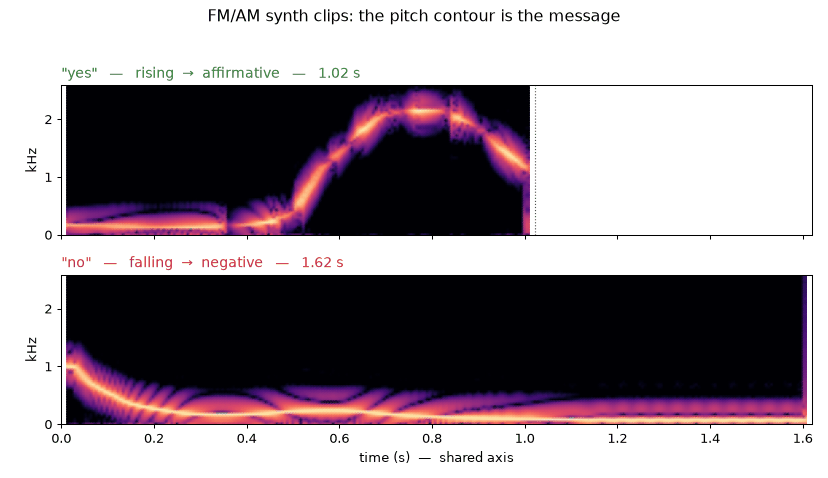

# Building Shoggoth Mini — Part 2: Shoggoth Mirror

<!-- SKELETON. Section headers and notes to write into; prose is yours.
     Notes in HTML comments are prompts and figures to hand, not copy.
     Numbers quoted below are measured and traceable to a commit or a tool run;
     re-check any of them before publishing, since the tuning is still moving. -->

---

## Introduction

<!-- Two sentences on what the mirror IS, before any implementation detail:
     it watches a face and mirrors the state back through movement.
     Part 1 opened with a GIF and that worked; lead with one here too.
     Link back to Part 1, which ended promising exactly this:
     "explore expressive motions (likely going beyond the 2D projection), add
     non-human sound, and potentially additional layers of perception." -->

Shoggoth-Mirror is a second-iteration on the original Shoggoth project, where now via the camera it perceives the user's face and mirrors the perceived state of the user back through movement of its tentacle.

https://github.com/user-attachments/assets/29a01006-a96b-4f6e-93fa-270ad1ab9489

---

## Why a mirror

Given that I'm working toward making Shoggoth a fully-interactive multi-modal 'device', my goal was to first have Shoggoth act as 'mirror' to the user. Perceiving the user's state of course is a fundamental part to human-robot interaction, so I figured having this first step would be 1) useful to debug how perception translates into conception of a user's 'state' and 2) a good springboard to explore a larger space of motions as well as including sound to develop better intuition how to make Shoggoth appear "lifelike", even as a mirror.

I looked to the ELEGNT paper as some inspiration for this phase. The authors split expressive momvement into four categories: intention, attention, attitude, and emotion. With this mirror phase, the emphasis is on attention and emotion. Attention of course in perceiving the user and deducing a state and emotion in trying to play back that that perceived state in an expressive enough motion that the user can intuit an 'emotional' state from Shoggoth. Given that Shoggoth's only form of expression is tentacle movement and sound, it's an interesting constraint. 

---

## System Design

  
   
  <em>System Diagram for Shoggoth-Mirror</em>

The overall system flow for Shoggoth-Mirror can be best encapsulated at a high-level in the diagram above. Overall, the camera feed drives the perception. A variety of machine learning models under the MediaPipe framework from Google extract features like facial presence, pose, and blendshape (facial and eye movements). Those artifacts are fed into a variety of detection schema for inferring input states that go into the state machine. At the moment broken down into, the following inputs are: attention (is user facing Shoggoth), head gesture (did user nod 'yes' or shake 'no'), and Emotion (inferred from arousal and valence values).

These states are then fed into the state machine, which determines the overall state of the user that Shoggoth will mirror and then plays that state back via MotionWorker (which essentially carries the motion primitive and vocalization to be played based on the state). The state machine architecture is defined by state tables that I defined (4 tables overall, in shoggoth-mirror-state folder) which are parsed and then implemented in `affect/fsm.py`. See the transition definitions table below:

  
   
  <em>State Transition Table for Shoggoth Mirror</em>

The parser converts the definitions laid out in the tables into executable transitions: each row's condition becomes a list of Terms, its hold time a float, and "Any except ALONE" an explicit list of source states. Nothing restates the table in code, so the checker, the generated diagram and Shoggoth are all reading the same 9 states and 16 rows.

Some insight behind some of the transition choices:

1) For "Yes" and "No" detection, I set that as priority 1 as it should override any current state to communicate the fact that it acknowledges/mirrors the user's shaking/nodding.

2) Transitioning to ALONE when face is not present: this should override any previously registered emotion state, hence priority 2

3) Transition to NOTICING: similar with 2, this should override any previously registered emotion state once attention is lost

I used a clash map check to ensure there were no-conflicting transitions (largely resolved using the priority ordering).

---

## Perception: from a face to a number

  
   
  <em>Example from debug overlay showcasing face landmarks, inferred state, Shoggoth's state and other key parameters</em>

Here, I'm leveraging a few of the models in Google's MediaPipe framework. The face_landmarker task is a bundle of four: a face detector, a 478-point landmark mesh, a 52-channel blendshape predictor, and a geometry pipeline producing the head's 4x4 homogeneous transform. Everything the state machine consumes is derived from those four outputs. I validated the camera calibration by making sure the measured interpupillary distance is within 55-72 mm (the average adult range), which at least on 95% of frames was the case with a median IPD of 64.7 mm. So from there, we could have some faith in calculated yaw and pitch values used for the attention and shake/nod detection.

For the arousal and valence values, I use a hand-tuned weighted sum of certain blendshapes. The output is then clipped to [-1, 1] and then I use two independent sign tests + deadband (to prevent state flip-flopping).

Both values are measured as a **change from a running 20 s median**, not as absolute numbers — a resting face isn't (0, 0), and everyone's is different. The two signs then pick the quadrant:

|                    | **Δvalence < 0** | **Δvalence > 0** |
| ------------------ | ---------------- | ---------------- |
| **Δarousal > 0**   | ANGRY            | EXCITED          |
| **Δarousal < 0**   | SAD              | CONTENT          |

with two escapes that aren't quadrants at all:

| Condition | Label | Why |
| --- | --- | --- |
| `hypot(Δarousal, Δvalence) < 0.20` | NEUTRAL | inside the deadband, so no emotion is claimed |
| no face | UNKNOWN | an absence of evidence, not evidence of calm |

The reason it's two independent sign tests rather than one combined score: a single weighted sum projects the plane onto a line and collides the diagonally opposite quadrants — ANGRY (+arousal, −valence) and CONTENT (−arousal, +valence) would both land on zero. Keeping the axes separate is the whole point of using a circumplex in the first place.

Both the deadband and the sign tests are hysteretic (the deadband shrinks to 65% once you're outside it, and each sign test carries a ±0.04 margin), which is what stopped the labels flickering at the boundaries.

This part of the pipeline is absolutely the most fragile part. Inferring emotional expression from pure facial landmarks has always been quite contested (see Barrett et al. "Emotional Expressions Reconsidered: Challenges to Inferring Emotion From Human Facial Movements."). I found during my tests I definitely needed to exaggerate my smiles and eyebrow movement to go from content to excited and sad to angry. At least with enough intention though, you can get the recognized response, but definitely by no means a great ambient reader of emotion. My goal would be for the next iteration is to use the voice input as a coarse adjuster of inferred emotional state (i.e. topic of conversation, cadence, frequency, etc.)

---

## Motion: designing a vocabulary

The motion design was the most playful part of the project. While I carried over a few of the primitives from the original Shoggoth project ("yes", "no"), I wanted to add some more that I felt mimed emotional state in a more efficient way for a device where the only movable body is a pseudo-3 DoF tentacle. I'd cite my main sources of information from popular animation such as Disney/Pixar movies, Pokemon (games and anime), as well as animal behavior, primarily dogs and monkeys, who are quite communicative using their tails (a similar appendage). Onto the primitives:

1) ALONE / NOTICING: "slow_breathe", "normal_breathe"

Given for these states, there either is no user or the user is just starting to be perceived, I opted for a sort of breathing mimetic, with the tentacle going in and out of an arched shape. For ALONE, I opted for a slower breathing pattern to convey that shoggoth is at rest

  
   
  <em>Time vs motor position plot of "normal_breathe" and "slow_breathe"</em>

2) NEUTRAL: "slow_circle"

This is the closest analog to the "idle" motion primitive Mattheiu had specified in the original project. In my experience, the randomness of "idle" made it a bit difficult to infer what the "state" was at times. With that, I opted for a deterministic and repeatable motion to convey a sort of "loading" intent, which NEUTRAL represents in my opinion. For that, I opted going with a circle of growing radius (linearly ramped up and down), essentially a spiral over time. 

  
   
  <em>Time vs motor position plot of "slow_circle"</em>

3) CONTENT + EXCITED: "side_side", "side_side_fast"

My biggest inspiration for this was essentially a happy dog waving her tail side to side. However, prototyping that on Shoggoth didn't have the same effect, so I opted for some more dynamics. Thinking of game and movie animation, I opted to add a little 'stutter-step' at the end of the cycle (i.e. when the tentacle is at max deflection). This mathematically takes the form of not a sinusoid, but a piecewise raised-cosine interpolation through a list of fractional targets. So instead of just sweeping between the two extremes and turning around, it overshoots its own turn. At each side it pulls back about 30%, then drives 20% past where it just was, and only then heads across to the other side. Every leg uses the same easing — frac = cur + (target − cur) · (1 − cos(π·i/n)) / 2 — which means it's always at zero velocity when it arrives and when it leaves, so none of the joins snap. The timing is the trick: those two little beats run 2–3× faster than the sweep, and that change in speed is what your eye actually picks up. For EXCITED, this same motion profile is sped up to convey the 'elevated' level of contentment :)

  
   
  <em>Time vs motor position plot of "side_side" and "side_side_fast"</em>

4) SAD + ANGRY: "arched"

Again, inspiration for this was a dog having his tail between his legs. I deliberately made the motion for SAD and ANGRY to be the same because I found those two emotions to be the most unreliable and usually was trigged by the same time of frowning. So this choice more of a band-aid partially than a creative direction. That being said, I do feel making Shoggoth come across as ANGRY is quite a challenge given its endearing form factor, and the only options I felt were viable would make the tentacle exhibit dynamics that could potentially self-harm Shoggoth, so for now that's been opted out. Additionally, for the ultimate goal of the having Shoggoth be a true interactive partner, I don't believe having an angry primitive is a beneficial design goal (AI alignment and all that). The 'arched' motion primitive itself is quite simple: just a linear ramp to a fixed offset (currently at 700 ticks).

  
   
  <em>Time vs motor position plot of "arched"</em>

5) YES + NO: "yes", "no"

The motion primitives have been largely borrowed from the original project (I did slow down "no" to match the motor slew rate). What's different is I've coupled the motion with a sound that plays. As you can imagine, this concept can be further extended to other states but "yes" and "no" were the most straightforward given that they have a specified duration of motion that you can match the audio up with. 

  
   
  <em>Time vs motor position plot of "yes", "no"</em>

As for how I came up with the audio: I went fully overboard and vibe-coded a FM + AM synthesizer plug in where you coud 'hand-draw' (via computer trackpad) the period of the profile of the frequency modulation and amplitude modulation over a specified time duration and then specify the range, offset, etc. of the modulation via knobs on the interface. I looked toward Star Wars droid sounds for inspiration here (R2-D2 mostly) and generally the school of though is going from high to low pitch is a negative association, so I went with that modulation for "no" and conversely, low to high pitch is a positive, affirmative one, so went with that for "yes".

   
  <em>A dramatization (read: demo) on how I created the "yes" and "no" sounds</em>

   
  <em>Spectrograms of "yes" and "no waveforms - note the rise/fall and fall/rise of pitch for each</em>

---

## Making it react

The orchestrator is the part that actually ties it all together, and it's deliberately simple: perception feeds the state machine, the state machine picks a state, and each state has a body it plays. There's no LLM anywhere in that loop. I called it orchestrate_mirror to keep it distinct from Matthieu's original orchestrate, which is an LLM sitting in a voice loop calling primitives as tools. Mine is more like a sequencer.

The biggest problem I had when actually running on the Shoggoth hardware was that the primitives couldn't be interrupted.

ALONE plays slow_breathe, which is about 24 seconds long. The worker checked for a new state between primitives, not during one, so if you walked up while it was breathing, Shoggoth would just... keep breathing. For up to most of half a minute. Not exactly a great mirror

The fix was to have the primitives now check a flag between command points and bail out early. That took the reaction time from ~24 s down to about half a second. The bit that mattered more than I expected was the eased exit. If you just stop mid-motion, the tentacle is left wherever it happened to be, and the reset back to neutral then snaps it home at whatever rate the servos can manage. This doesn’t look great and was one of the areas I felt made orchestrate from Part 1 feel a bit off. So the interrupt eases to neutral over 0.3 s first, then hands over.

---

## On verification

A lot of this phase was only debuggable through tooling, so I ended up building a few things whose entire job is to check the other things. affect_golden.py pins every quantity the affect stack produces (labels, baselines, gesture spans, FSM traces) to ensure nothing changed when pulling ~500 lines into a shared library.

mirror_rehearsal.py does the same for motion, running the exact primitives orchestrate_mirror would with the tendons still attached, so I could rehearse the whole state machine on the real robot without committing to it. 

The catch is that a golden test only pins down behaviour, not correctness. If no fixture actually exercises a bug, it'll lock the bug in and  report that nothing changed, which is exactly what happened with a couple of my test videos that turned out to have no face in them. 

---

## Open Issues

The biggest one by far is the arousal/valence weighting, which is still just hand-picked 16 numbers. Arousal especially is the weak axis, since every weight in it only ever adds to a neutral face, so it basically never goes negative and saturates well before you've run out of expression, which is a big part of why SAD and ANGRY sit so close together. On the motion side, transitions between states still cut rather than blend: CONTENT to EXCITED is literally the same shape at two settings and could be made continuous, but right now it just stops one primitive and starts the other. And a few smaller ones I'm aware of: the head pose signs were never actually verified against the rig, there's no fast abort (Ctrl+C is graceful, not an emergency stop), and the arch sits close enough to the encoder range that the margin shrinks a little every time I re-tension.

---

## A note on AI-assisted development

Almost all of the code this phase was written with Claude Code. I'd work out the architecture, the design choices and the debug path, and hand off the implementation. A genuine change was with tooling, since building a checker or a plotting harness used to be something I'd skip because it wasn't the "real" project and now it's cheap enough that I'll build the thing that checks the thing almost by reflex

---

## What's next

The immediate thing I'm working on is making the motion continuous across state transitions, starting with CONTENT to EXCITED since those are two settings of the same shape and should be able to just morph rather than stop and restart. The endpoint I'm aiming for is a motion layer where a state sets targets for amplitude, frequency and character and the motion drifts toward them, instead of picking from a menu of primitives, which is the architecture the whole affect/state split has been pointing at from the start. I am also scoping voice path (the greyed out part of the diagram), both as an input to make the emotional read less fragile and as an output so Shoggoth has something more than "yes" and "no" to say and while also harmonious with the motions performed. Similar to the Matthieu’s original but with Voice input working in tandem with the visual perception layer. Longer term that's the actual goal here: a genuinely interactive partner rather than a mirror.

---

## Credits & links

- Original project + writeup: Matthieu Le Cauchois — https://www.matthieulc.com/posts/shoggoth-mini/
- Part 1: [Getting It Working](README.md)
- ELEGNT paper: https://arxiv.org/pdf/2501.12493
- SpiRobs (tentacle) paper: https://arxiv.org/pdf/2303.09861
